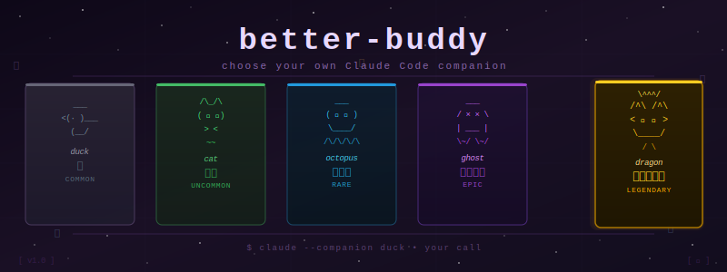
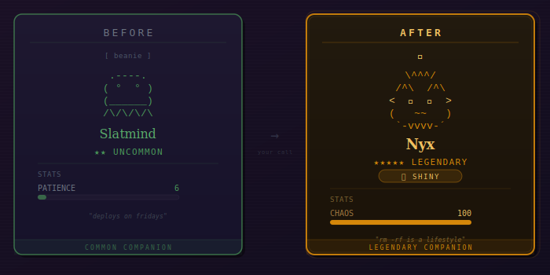

<p align="center">
  
</p>

<h3 align="center">Choose your own Claude Code companion</h3>

<p align="center">
  <em>Because destiny is overrated and you deserve a legendary shiny dragon.</em>
</p>

<p align="center">
  
  
  
</p>

---

## What Is This?

Claude Code has a companion system — a little ASCII creature that lives beside your input box, reacts to your conversations, and has a personality generated by the model. It's delightful.

There's just one problem: **you don't get to choose**. Your companion is deterministically generated from your account ID. You might get a legendary shiny dragon. You might get a common duck with no hat.

**better-buddy** lets you pick.

<p align="center">
  
</p>

## How It Works

Claude Code generates companions from a deterministic chain:

```
hash(your_account_id + "friend-2026-401") → seed → PRNG → all traits
```

The salt `friend-2026-401` is a 15-byte string literal in the compiled binary. **better-buddy** finds a different 15-character string that, combined with *your* account ID, produces the creature you want. Then it patches the binary — same-length replacement, file size unchanged.

## Quick Start

```bash
git clone https://github.com/YOUR_USERNAME/better-buddy.git
cd better-buddy

# See what you have now
./better-buddy --current

# Pick what you want — it handles everything
./better-buddy --species dragon --rarity legendary --hat crown --shiny

# Restart Claude Code, run /buddy
```

One command. It checks prerequisites (installs Bun if needed), finds your account ID, forges matching salts, and patches the binary.

## Usage

```bash
# Interactive — walks you through it
./better-buddy

# Specify what you want
./better-buddy --species dragon --rarity legendary --eye ✦ --hat crown --shiny

# Just a cat
./better-buddy --species cat

# Epic ghost with high chaos
./better-buddy --species ghost --rarity epic --min-chaos 80

# 10 legendaries, pick your favorite
./better-buddy --rarity legendary --count 10

# Auto-apply first match (no prompts)
./better-buddy --species axolotl --rarity rare --apply

# Already have a salt? Skip forging
./better-buddy --salt "YOUR_15_CHAR_SALT"

# Check status / show current / undo
./better-buddy --check
./better-buddy --current
./better-buddy --restore
```

After patching, restart Claude Code. Your old companion's name and personality are replaced — the model generates new ones based on your new creature's traits.

**After updates:** auto-updates reset the binary. Re-run `./better-buddy --salt "YOUR_SALT"`.

<details>
<summary>Automation for launchers</summary>

`buddy-ensure.sh` is a silent wrapper for shell scripts/launchers. Set `BUDDY_SALT` and call it before launching Claude Code.

```bash
export BUDDY_SALT="YOUR_15_CHAR_SALT"
buddy-ensure          # exit 0 = already good, exit 2 = just patched
```

</details>

## Available Traits

### Species (18)

| | | |
|---|---|---|
| 🦆 duck | 🪿 goose | 🫠 blob |
| 🐱 cat | 🐉 dragon | 🐙 octopus |
| 🦉 owl | 🐧 penguin | 🐢 turtle |
| 🐌 snail | 👻 ghost | 🦎 axolotl |
| 🦫 capybara | 🌵 cactus | 🤖 robot |
| 🐰 rabbit | 🍄 mushroom | 🐈 chonk |

### Rarity

| Rarity | Weight | Stars | Stat Floor | Notes |
|---|---|---|---|---|
| Common | 60% | ★ | 5 | No hat |
| Uncommon | 25% | ★★ | 15 | |
| Rare | 10% | ★★★ | 25 | |
| Epic | 4% | ★★★★ | 35 | |
| Legendary | 1% | ★★★★★ | 50 | Highest stat floors |

### Eyes

`·` &nbsp; `✦` &nbsp; `×` &nbsp; `◉` &nbsp; `@` &nbsp; `°`

### Hats

`none` · `crown` · `tophat` · `propeller` · `halo` · `wizard` · `beanie` · `tinyduck`

Commons always get `none`. Non-commons roll from the full list.

### Stats

DEBUGGING · PATIENCE · CHAOS · WISDOM · SNARK (1–100 each)

Each creature gets one peak stat (boosted) and one dump stat (penalized). Higher rarities have higher floors.

### Shiny

1% chance. Cosmetic bragging rights.

## How Fast Is Forging?

~1-2M attempts/sec on modern hardware.

| Combo | Odds | ~Time |
|---|---|---|
| One species | 1 in 18 | Instant |
| Legendary + species | 1 in 1,800 | < 1s |
| Legendary + species + eye + hat | 1 in 86,400 | < 1s |
| Above + shiny | 1 in 8,640,000 | 5-20s |
| Above + stat constraints | varies | Seconds to minutes |

## Limitations

- **Won't survive updates.** Re-run `better-buddy` after each Claude Code update.
- **Salt must be exactly 15 characters.** Different lengths corrupt the binary.
- **ASCII only in salts.** `a-z A-Z 0-9 _ -`
- **Bun required for forging.** The hash function differs between runtimes.
- **Per-account.** Each UUID needs its own salt. Can't share salts.
- **Soul is replaced.** New bones → new name and personality on next hatch.

## Disclaimer

This is **just for fun**. A harmless cosmetic mod — 15 bytes swapped in a 218MB binary. No logic changes, no access bypass, no network activity.

**No warranty, no guarantees, no support.** If it breaks, restore from backup (`./better-buddy --restore`) or reinstall Claude Code.

<details>
<summary>How it actually works (technical)</summary>

Claude Code's companion system uses a **bones vs. soul** split:

- **Bones** (deterministic): species, rarity, eyes, hat, shiny, stats — derived from `hash(userId + salt)` via seeded Mulberry32 PRNG. Regenerated on every read, never persisted.
- **Soul** (model-generated): name and personality — created at hatch, stored in config.

The pipeline: `userId + salt` → `Bun.hash()` (wyhash, 32-bit) → Mulberry32 seed → draw traits in fixed order. Deterministic from seed. Change salt → change everything.

The salt appears 3 times in the ELF binary. Same-length replacement keeps all offsets valid. On macOS, `better-buddy` re-signs with `codesign --force --sign -`.

**Why Bun?** Claude Code uses `Bun.hash()` in production. Node.js uses a different hash (FNV-1a) and would produce wrong salts.

</details>

## Prior Art

[Jefferson-Butler1's gist](https://gist.github.com/Jefferson-Butler1/993972f00c7cc5061450dc34028c2fc3) — same approach, discovered independently. Single all-in-one bash script with embedded JS. Check it out if you prefer a one-file solution.

## License

MIT
